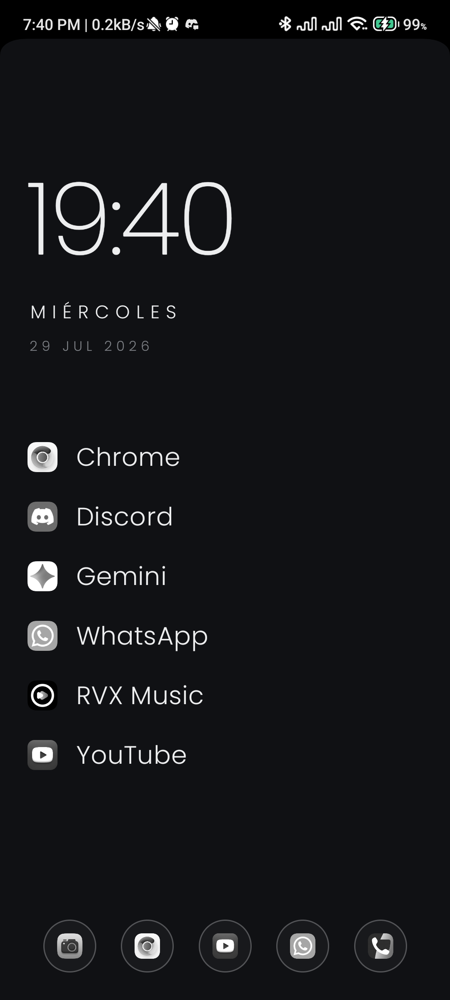

# SyncroApp Launcher

Un launcher minimalista para Android. Pantalla negra, la hora en tipografia grande y fina, y sus
aplicaciones como una lista. Sin cuadriculas de iconos, sin widgets, sin feeds, sin publicidad.

**Sin rastreadores y sin permiso de internet.** Un launcher ve cada app que usted abre; este no
tiene forma tecnica de contarselo a nadie.



---

## Estado

**v0.2.0 — funcional y en uso diario, todavia temprano.** Es un proyecto personal publicado como
software libre. No esta en Google Play y no hay planes de publicarlo alli: se instala desde el
APK de las releases o compilandolo usted mismo.

### Lo que ya funciona

- Pantalla de inicio en dos estilos: **reloj grande** (hora, dia completo espaciado y fecha) o
  **dia en contorno** (el dia abreviado a sangre). Tamano pequeno, mediano o grande.
- Se dibuja completa en **menos de un segundo**, iconos incluidos: los favoritos no esperan a que
  el sistema termine de enumerar las aplicaciones instaladas.
- Lista de favoritos (hasta 8), con reordenar, renombrar y quitar. Se autorrepara: un favorito
  cuya app se desinstalo desaparece en vez de quedar como fila muerta.
- Iconos: originales a color en el cajon (para reconocer una app cuyo nombre no recuerda) y
  monocromos en el inicio. O sin iconos, si prefiere solo texto.
- Cajon de aplicaciones con busqueda difusa: tolera erratas, ignora tildes ("camara" encuentra
  "Cámara"), busca por iniciales ("gm" encuentra "Google Maps") y Enter abre el primer resultado.
- Gestos: deslizar arriba abre el cajon, deslizar abajo despliega las notificaciones, mantener
  presionado el fondo abre Ajustes.
- **Recupera los gestos de navegacion que MIUI apaga** (ver mas abajo).
- Ocultar aplicaciones del cajon y de la busqueda.
- Aplicaciones de perfil de trabajo, diferenciadas.
- Temas: negro puro, oscuro suave, claro y segun el sistema. Alineacion izquierda/centro/derecha,
  tres densidades de lista, formato de 12 o 24 horas.
- Accesibilidad: descripciones para TalkBack, areas tactiles de 48 dp minimo, todo el texto en
  `sp` para respetar el escalado del sistema.

- **Gestos de navegacion propios** para los equipos donde el sistema los desactiva, y opcion de
  ocultar la barra de navegacion (ver mas abajo).
- **Dock inferior** de hasta cinco accesos rapidos en circulos de contorno.
- Cerrar el cajon arrastrando hacia abajo; si la lista esta a media altura, primero la sube.

### Lo que falta

- Selector de tipografia (hoy usa Poppins, empaquetada en la app).
- Conjunto propio de iconos de linea para las aplicaciones mas comunes.
- Bienestar digital: pausa consciente antes de abrir apps marcadas como distractoras.
- Bloqueo de apps con biometria, respaldo y restauracion de la configuracion.
- Gestos del launcher configurables (hoy son fijos) y sensibilidad ajustable de los de borde.
- Que los gestos propios se apaguen solos en Android puro, donde los nativos son mejores.
- Pruebas de los ViewModels, de la envoltura de `LauncherApps` y del servicio de gestos: hoy la
  cobertura esta concentrada en `:core:data` y no cubre el codigo de mas riesgo.

El detalle de cada version esta en el [registro de cambios](CHANGELOG.md).

## Instalacion

Descargue el APK de la seccion de releases e instalelo. Despues, en la app, toque **Establecer
como pantalla de inicio**.

> En MIUI, HyperOS y otras capas, el dialogo del sistema a veces no aparece. Para ese caso la app
> ofrece siempre un segundo boton que abre directamente los ajustes de pantalla de inicio.

## Los gestos de navegacion en Xiaomi

MIUI y HyperOS **desactivan los gestos de pantalla completa** cuando el launcher predeterminado
no es el suyo, y dejan el telefono en botones. Xiaomi lo dice sin rodeos en su propia pantalla
de ajustes: *"No se pueden usar gestos de pantalla completa con lanzadores de terceros."*

La causa esta documentada en [ADR-007](docs/adr/ADR-007-gestos-propios.md): en esos equipos el
unico proveedor del servicio del sistema que implementa atras, inicio y recientes es el launcher
de Xiaomi. Con otro launcher predeterminado nadie atiende esos gestos, y MIUI no pone un
reemplazo. **Ninguna app puede arreglar eso**, y forzar el ajuste solo esconde los botones sin
devolver la navegacion, dejando el telefono sin forma de salir de una aplicacion.

### Gestos propios

La solucion es no depender de los del sistema. Actívelos en
**Ajustes → Navegacion del sistema → Activar gestos propios**, que lleva a la pantalla de
accesibilidad de Android.

| Gesto | Accion |
|---|---|
| Deslizar desde el borde izquierdo o derecho | Atras |
| Deslizar rapido desde el borde inferior | Ir al inicio |
| Deslizar desde el borde inferior y sostener | Aplicaciones abiertas |

El servicio **no lee el contenido de la pantalla** (`canRetrieveWindowContent="false"`): solo
dibuja tres zonas invisibles en los bordes y ejecuta esas tres acciones.

### Recuperar el espacio de la barra

Con los gestos propios activos aparece **Ajustes → Navegacion del sistema → Ocultar la barra de
navegacion**. Requiere conceder una vez, por adb, un permiso que no se puede pedir desde un
dialogo:

```bash
adb shell pm grant dev.syncroapp.launcher android.permission.WRITE_SECURE_SETTINGS
```

La opcion tiene tres candados para no dejarlo sin navegacion: solo aparece si los gestos propios
estan activos, se niega a ocultar la barra si no lo estan, y **si el servicio deja de estar
activo, la barra vuelve sola** al entrar al launcher. En equipos que no son Xiaomi la seccion no
aparece, porque ahi los gestos nativos funcionan y son mejores.

## Compilar

Necesita el SDK de Android y un JDK 17 o superior (sirve el que trae Android Studio).

```bash
git clone https://github.com/juandr404/syncroapp-launcher.git
cd syncroapp-launcher
./gradlew assembleDebug
```

El APK queda en `app/build/outputs/apk/debug/`. Para instalarlo en un dispositivo conectado:

```bash
./gradlew installDebug
```

Pruebas unitarias:

```bash
./gradlew test
```

Analisis estatico (detekt, con las reglas de formato de ktlint embebidas):

```bash
./gradlew detekt
```

Para que corrija el estilo automaticamente en lugar de solo reportarlo:

```bash
./gradlew detekt -PdetektAutoCorrect
```

Antes de publicar conviene compilar la variante de release: aplica R8 y descubre problemas de
`keep rules` que la de depuracion no puede ver.

```bash
./gradlew assembleRelease
```

## Arquitectura

Kotlin + Jetpack Compose, `minSdk 26`, `targetSdk 35`.

```
:app                  actividad HOME, navegacion, pantallas y ViewModels
:core:ui              tema, tipografia, componentes y gestos
:core:data            ajustes (DataStore), buscador difuso, reloj del sistema
:core:launcherapps    frontera con el sistema: LauncherApps, RoleManager, acciones
```

El modulo importante es `:core:launcherapps`. Todo lo que depende del sistema operativo —listar
y lanzar aplicaciones, pedir ser el launcher predeterminado, las diferencias entre versiones de
Android y entre fabricantes— vive detras de interfaces. El resto de la app no sabe que existe
`LauncherApps`, lo que la hace testeable y concentra los parches por fabricante en un solo sitio.

El estado se deriva de flujos reactivos: si instala una app, cambia un ajuste o pasa un minuto,
la interfaz se recalcula sola. No hay estado mutable repartido por las pantallas.

Documentacion:

- [Decisiones de arquitectura (ADR)](docs/adr/README.md) — que se decidio, por que y que se sacrifico.
- [Sistema de diseno](docs/diseno.md) — tipografia, color, espaciado, motion, accesibilidad.
- [Arquitectura completa](docs/arquitectura.md) — incluye lo que aun no esta implementado.

## Privacidad

- No declara el permiso de internet. Verificable en los ajustes del sistema o descompilando el APK.
- Sin analitica, sin publicidad, sin SDK de terceros.
- Toda la configuracion se guarda solo en su dispositivo.

Permisos declarados:

- `EXPAND_STATUS_BAR` — nivel normal, para el gesto de deslizar hacia abajo.
- `WRITE_SECURE_SETTINGS` — **no se puede conceder desde la app**; requiere adb. Se usa
  unicamente para devolver los gestos de navegacion en Xiaomi (ver arriba) y solo si usted lo
  concede y activa la opcion. Si no lo hace, la app nunca lo tiene.
- Un bloque `<queries>` para poder listar las aplicaciones instaladas.

No se declara `QUERY_ALL_PACKAGES`: los launchers estan exentos del filtrado de visibilidad de
paquetes de Android 11+, asi que no hace falta.

## Licencia

[GPL-3.0](LICENSE). Puede usarlo, estudiarlo, modificarlo y redistribuirlo; los trabajos derivados
deben mantenerse bajo la misma licencia.
